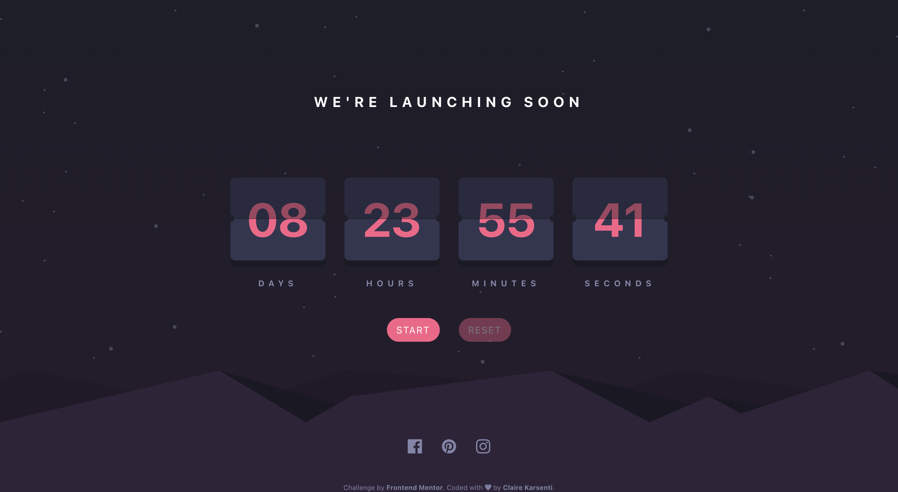
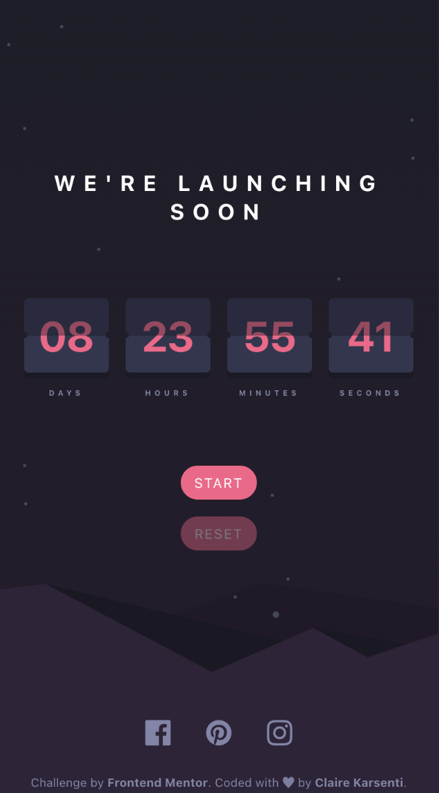

# Frontend Mentor - Launch countdown timer solution

This is a solution to the [Launch countdown timer form challenge on Frontend Mentor](https://www.frontendmentor.io/challenges/launch-countdown-timer-N0XkGfyz-).
Frontend Mentor challenges help me improve my coding skills by building realistic projects.

## Table of contents

- [Frontend Mentor - Launch countdown timer solution](#frontend-mentor---launch-countdown-timer-solution)
  - [Table of contents](#table-of-contents)
  - [Overview](#overview)
    - [The challenge](#the-challenge)
    - [Models \& my works](#models--my-works)
      - [Desktop version](#desktop-version)
      - [Mobile version](#mobile-version)
      - [Active states version](#active-states-version)
    - [Links](#links)
  - [My process](#my-process)
    - [Built with](#built-with)
    - [What I learned](#what-i-learned)
    - [Useful resource](#useful-resource)
  - [Setup](#setup)
  - [Author](#author)

## Overview

### The challenge

Users should be able to:

- See hover states for all interactive elements on the page
- See a live countdown timer that ticks down every second

### Models & my works

#### Desktop version

| Model   |            |
| ------- | -------------------------------------------------------------------- |
| My work |  |

#### Mobile version

| Model                                                    | My work                                                            |
| -------------------------------------------------------- | ------------------------------------------------------------------ |
|  |  |

#### Active states version

| Model   |                  |
| ------- | ------------------------------------------------------------------------------- |
| My work |  |

### Links

- Solution URL: [Code on GitHub](https://github.com/ClaireKarsenti/Launch-Countdown-Timer)
- Live Site URL: [GitHub Pages Live URL](https://clairekarsenti.github.io/Launch-Countdown-Timer)

## My process

### Built with

- Semantic HTML5 markup
- CSS custom properties
- Flexbox
- Styled Components
- React
- TypeScript
- Mobile-first workflow

### What I learned

I choose to do this project in TypeScript language and with the framework React to deepen my skills in these fields, especially in the creation and the use of React custom hooks.
This challenge also allowed me to deepen my knowledge of CSS.

Here are some example of my code and some of my customization I added to this project:

- :play_or_pause_button: I added a button to control the start of the countdown. This button can also pause the countdown.
- :arrows_counterclockwise: I also added a reset button. This button is available only when the countdown is running.

  ```html
  <CountDownControl>
    <button onClick={() => setIsStarted(!isStarted)}>
        {isStarted ? 'pause' : 'start'}
    </button>
    <button onClick={reset} disabled={!isStarted}>
        reset
    </button>
  </CountDownControl>
  ```

  ```js
  // Start and pause buttons:
  useEffect(() => {
    const initialInterval: any = setInterval(() => {
      setTimeSpan((prevCount) => prevCount - SECOND);
    }, SECOND);

    if (!isStarted) {
      clearInterval(initialInterval);
    }

    //Just a simple handler to make sure that the counter doesn't go to infinity negative:
    if (timeSpan === 0) {
      setTimeIsUp(true);
      clearInterval(initialInterval);
      return;
    }

    return () => clearInterval(initialInterval);
  }, [timeSpan, isStarted, interval]);

  // Reset button:
  const reset: () => void = () => setTimeSpan(deadLine);
  ```

### Useful resource

[Resource 1](<https://dev.to/yuridevat/how-to-create-a-timer-with-react-7b9#:~:text=%2F%2F%20Timer.-,js%20import%20React%20from%20'react'%3B%20import%20%7B%20useState%20%7D,getTime%20%3D%20()%20%3D%3E%20%7B%20const>) - This helped me to created custom hooks.

## Setup

To run this project, install it locally using yarn:

```
yarn install && yarn start
```

## Author

- Linkedin - [Claire Karsenti](https://www.linkedin.com/in/claire-karsenti/)
- Frontend Mentor - [@ClaireKarsent](https://www.frontendmentor.io/profile/ClaireKarsenti)
